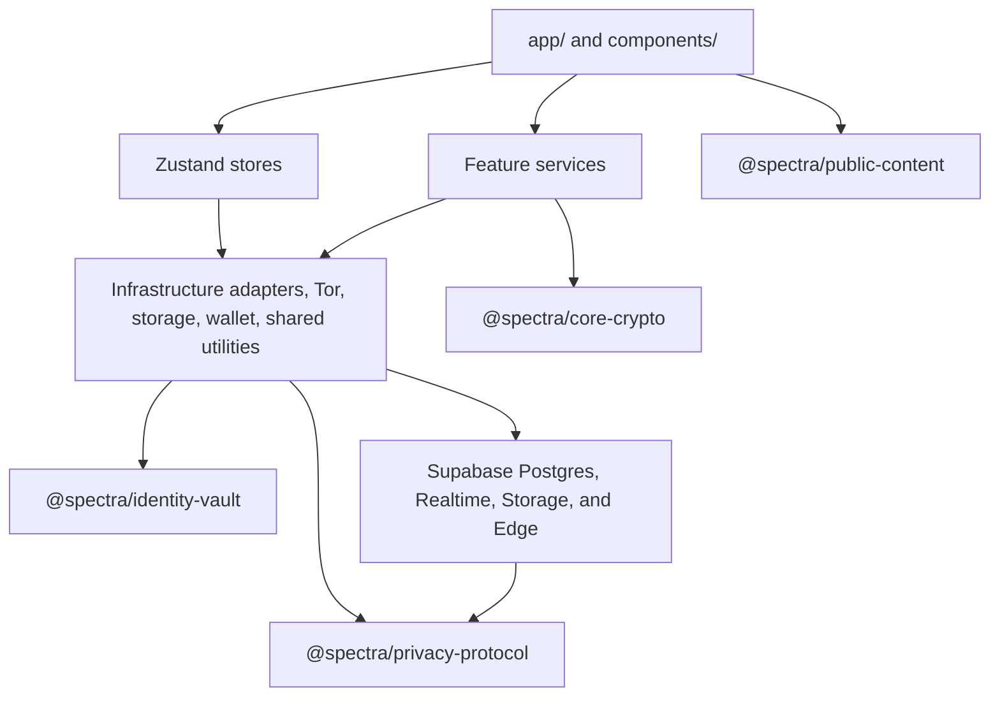

<!--
Copyright (c) 2026 MOZAGA FOUNDATION.
SPDX-License-Identifier: AGPL-3.0-only OR LicenseRef-Spectra-Commercial
See LICENSE.md, LICENSE-AGPL-3.0.txt, and LICENSE-COMMERCIAL.md for details.
-->

# Spectra

Spectra is a privacy-focused, wallet-linked messaging application built with Expo, React Native, TypeScript, Supabase, Deno Edge Functions, and auditable cryptographic packages maintained inside this repository.

The project combines end-to-end encrypted chat, wallet-based identity, post-quantum-oriented key agreement and signatures, Tor-aware transport paths, blind-token privacy flows, encrypted local vaults, Bluetooth nearby messaging where supported, media sharing, calls, notifications, an optional public Agora plaza, on-chain market features, and a Supabase infrastructure adapter.

> Spectra is security-sensitive software. The repository is structured for review and testing, but it is not a substitute for an external cryptographic audit. See the package READMEs and license files before using any part of this project in production or commercial settings.

## Contents

- [Project Status](#project-status)
- [Highlights](#highlights)
- [Tech Stack](#tech-stack)
- [Repository Layout](#repository-layout)
- [Architecture](#architecture)
- [Getting Started](#getting-started)
- [Environment Variables](#environment-variables)
- [Available Scripts](#available-scripts)
- [Supabase Infrastructure Adapter](#supabase-infrastructure-adapter)
- [Internal Packages](#internal-packages)
- [Testing And Quality](#testing-and-quality)
- [Mobile Builds](#mobile-builds)
- [Security And Privacy Posture](#security-and-privacy-posture)
- [Contributing](#contributing)
- [License](#license)

## Project Status

This repository is the Spectra mobile application monorepo. The root package and every internal `@spectra/*` package are marked `private` and consumed as TypeScript source through local path aliases rather than published npm artifacts.

The source is publicly available on GitHub for review. Production operation, hosted use, commercial use, app-store distribution, and competing use are governed by the license terms described below.

## Highlights

- **End-to-end encrypted messaging** through `@spectra/core-crypto`, including hybrid X25519 + ML-KEM-768 initial agreement, ML-DSA-65 signatures, AES-256-GCM encryption, Double Ratchet style sessions, sealed relay/control envelopes, media encryption, and call signaling helpers. On iOS and Android, ML-KEM-768 and chat-identity ML-DSA-65 offload to native PQClean modules while `@noble/post-quantum` remains the JavaScript oracle.
- **Wallet-linked identity and custody** through `@spectra/identity-vault`, including BIP39 mnemonic support, deterministic recovery of one root EXO wallet, five transparent EXO wallets, one Spectre wallet, EVM/Bitcoin/Solana/Tron derivation, and encrypted vault records. Wallet and vault ML-DSA keys stay in JavaScript.
- **Spectre privacy protocol helpers** through `@spectra/privacy-protocol`, including RSA-FDH blind-token flows, wallet-auth challenge formatting, wallet-index activation bindings, Wesolowski VDF proof helpers, free Tor/Spectre access contracts, and minimized push payload helpers.
- **Supabase-backed app services** for custom wallet authentication, opaque relay/realtime wakeups, VDF-gated transient wallet activity delivery to encrypted local storage, encrypted object storage, Agora plaza records, generic app-data records, and maintenance workers including wallet, notification, market, and janitor entrypoints.
- **Privacy-aware transport options** including free Tor integration, certificate pinning for selected hosts, sealed relay records, opaque notification scope/event identifiers, and foreground nearby Bluetooth messaging where enabled.
- **Agora public plaza** for optional unencrypted topic rooms, whispers, occupancy, and media. Agora is isolated from private chat and is not end-to-end encrypted.
- **On-chain market features** for campaigns, primary sales, prediction markets, and escrow, served through the Spectra API and `spectra-market-worker`.
- **Native mobile experience** with Expo SDK 54, React Native 0.81, React 19, Expo Router, WebRTC calling, notification-first incoming calls, biometric unlock, SecureStore, media handling, QR flows, and localized resources.
- **Reviewable boundaries** with feature services, typed shared contracts, TypeScript strict mode, ESLint boundary rules, Vitest tests, and package-level audit notes.

## Tech Stack

- **App framework:** Expo SDK 54, React Native 0.81, React 19, Expo Router, TypeScript
- **State and data:** Zustand, TanStack React Query, typed shared contracts
- **Styling:** NativeWind, Tailwind CSS, shared UI components
- **Infrastructure adapter:** Supabase Postgres, Storage, Realtime, and domain-isolated Deno Edge modules with custom wallet auth
- **Crypto and identity:** `@noble/*`, `@scure/*`, internal Spectra packages, native PQClean ML-KEM-768 and ML-DSA-65 modules, native Wesolowski VDF arithmetic
- **Transport and native integrations:** Tor, Bluetooth LE with app-layer Noise link integration, WebRTC, Expo Notifications, SecureStore, Local Authentication
- **Testing and quality:** Vitest, Testing Library for React Native, ESLint, TypeScript
- **Build tooling:** npm, EAS, Expo config plugins, patch-package

## Repository Layout

```text
.
├── app/                         Expo Router screens and navigation groups
├── assets/                      Images, fonts, and static app assets
├── components/                  Shared UI, chat UI, wallet UI, call UI, and feature components
├── contexts/                    React context providers
├── hooks/                       Screen and feature hooks
├── lib/                         Constants, types, i18n, utilities, and app infrastructure
├── locales/                     Expo localization resources
├── modules/                     Local Expo/native modules
├── native/
│   ├── vdf-core/                Native Wesolowski VDF arithmetic (LibTomMath)
│   ├── mldsa-core/              Native ML-DSA-65 verify/sign (PQClean)
│   ├── mlkem-core/              Native ML-KEM-768 keygen/encaps/decaps (PQClean)
│   └── pq-common/               Shared native PQ helpers (CSPRNG, wipe, FIPS 202)
├── packages/
│   ├── spectra-core-crypto/     E2E messaging and cryptographic protocol package
│   ├── spectra-identity-vault/  Wallet, mnemonic, derivation, and encrypted vault package
│   ├── spectra-privacy-protocol/ Blind-token, wallet-auth, wallet-index, and VDF helpers
│   └── spectra-public-content/  Static help, legal, Agora terms, contact, and translation content
├── patches/                     patch-package overrides
├── plugins/                     Expo/native config plugins
├── scripts/                     Local audits, admin utilities, and release checks
├── services/                    App service layer (account lifecycle, Agora, chat, group chat, backend, Tor, BLE, calls, media, markets, security, storage, ...)
├── store/                       Zustand stores for auth, wallet, chat, Spectre, Tor, and app state
├── supabase/
│   ├── migrations/              Ordered Postgres schema, RLS, queue, and RPC migrations
│   ├── functions/               Domain-isolated Deno Edge entrypoints and shared adapters
│   └── tests/                   Offline protocol, state, and static security contracts
├── android/                     Android native project
├── ios/                         iOS native project
└── test/                        Test setup and shared test helpers
```

All server-side work belongs under `supabase/`, which is excluded from the mobile build archive.

## Architecture

Spectra uses a layered mobile architecture:



Feature modules live under `services/` and are intentionally isolated. Cross-feature communication flows through shared infrastructure and typed contracts rather than direct feature-to-feature coupling. ESLint boundary rules enforce these constraints.

Supabase is an infrastructure adapter behind the existing `services/backend/` mobile boundary. It does not move database, Edge, or SDK concerns into feature modules. Cross-feature callbacks and stable message, call, media, wallet-auth, and relay wire formats remain unchanged.

For deeper protocol and package-specific notes, see the internal package READMEs linked below.

## Getting Started

### Prerequisites

- Node.js `20.19.4` or another version matching `>=20.19.4 <21`
- npm
- Xcode and CocoaPods for iOS development
- Android Studio and an Android SDK for Android development
- Expo/EAS tooling for native builds
- Deno `2.9.4` for Edge checks and contracts
- A local runtime supported by the Supabase CLI for migration replay and database lint

### Install

```sh
nvm use
npm ci
```

The repository uses `package-lock.json` and `patch-package`. The exact Supabase CLI version is a root dev dependency, so use npm scripts instead of a global CLI. It is excluded from runtime dependencies, the mobile TypeScript project, and the EAS archive.

### Configure Environment

```sh
cp .env.example .env
cp app.config.local.example.js app.config.local.js
cp eas.submit.example.json eas.submit.local.json
```

Fill in `.env`, `app.config.local.js`, and `eas.submit.local.json` for your environment. Those files are gitignored and stay on your machine. [`app.config.js`](app.config.js) merges the tracked [`app.json`](app.json) base with your local override. The tracked templates use generic placeholders safe for GitHub.

Supabase project secrets belong in the hosted secret manager or an ignored local process environment. Do not commit `.env`, service-role keys, database URLs, private keys, seed phrases, signing certificates, production credentials, app-store credentials, or third-party API tokens.

Verify the split before publishing:

```sh
npm run verify:public-config
```

### Start The App

```sh
npm run start
```

Then open the app through Expo, an iOS simulator, an Android emulator, or a connected device.

Native run commands are also available:

```sh
npm run ios
npm run android
npm run web
```

The web command starts Expo's web target. Native security, Bluetooth, Tor, calling, and secure-storage integrations require their supported native builds.

## Environment Variables

The mobile app reads public Expo environment variables from `.env` and build profiles. Values prefixed with `EXPO_PUBLIC_` are bundled into the client, so do not put private tokens, paid RPC credentials, service-role keys, database URLs, or signing material there.

| Variable | Purpose |
| --- | --- |
| `EXPO_PUBLIC_SPECTRA_API_URL` | Spectra API URL used by the mobile client |
| `EXPO_PUBLIC_MOZAGA_RPC_URL` | Public MOZAGA RPC endpoint or non-secret fallback |
| `EXPO_PUBLIC_ETH_EXPLORER_URL` | Ethereum explorer URL |
| `EXPO_PUBLIC_BITCOIN_EXPLORER_URL` | Bitcoin explorer URL |
| `EXPO_PUBLIC_SOLANA_EXPLORER_URL` | Solana explorer URL |
| `EXPO_PUBLIC_TRON_EXPLORER_URL` | Tron explorer URL |

Production builds must set `EXPO_PUBLIC_SPECTRA_API_URL=https://zaobpddfzrwbijfzohxs.supabase.co/functions/v1/spectra-api` in the EAS production environment. Local Supabase development uses `http://127.0.0.1:54321/functions/v1/spectra-api`.

Supabase Edge secrets include project service credentials, database connectivity, Spectra access-token signing material, internal request secrets, object-signing secrets, blind-token private material, TURN credentials, and private RPC credentials. The server-only examples in `.env.example` are for local Edge/process configuration, not mobile Expo configuration. They must stay outside public Expo configuration and source control. The publishable key may identify a project but never grants service-role authority.

## Available Scripts

| Command | Description |
| --- | --- |
| `npm run start` | Start the Expo development server |
| `npm run ios` | Build and run the native iOS app locally |
| `npm run android` | Build and run the native Android app locally |
| `npm run web` | Start the Expo web target |
| `npm run lint` | Run ESLint across the repository |
| `npm run typecheck` | Run TypeScript checks for the app |
| `npm run typecheck:tests` | Run TypeScript checks for test configuration |
| `npm run test` | Start Vitest in watch mode |
| `npm run test -- --run` | Run Vitest once |
| `npm run test:privacy-protocol` | Run the privacy protocol package tests |
| `npm run test:audit` | Run the curated audit-focused test suite |
| `npm run benchmark:pbkdf2:js` | Benchmark PBKDF2 vault KDF performance |
| `npm run benchmark:media:crypto` | Benchmark media crypto performance |
| `npm run benchmark:dilithium:verify` | Benchmark ML-DSA verification performance |
| `npm run audit:locales` | Check locale/resource consistency |
| `npm run verify:ios-privacy` | Verify iOS privacy keys against resolved Expo config |
| `npm run verify:release-config` | Verify native release configuration and security-sensitive build settings |
| `npm run verify:public-config` | Verify tracked config files contain no private identifiers |
| `npm run supabase:start` / `npm run supabase:stop` | Start or stop the local Supabase stack |
| `npm run supabase:db:replay` | Recreate the local database and replay tracked migrations |
| `npm run supabase:db:lint` | Run database lint at warning level and fail on errors |
| `npm run supabase:db:test` | Run local database tests |
| `npm run supabase:edge:fmt` | Check Edge Function and contract formatting |
| `npm run supabase:edge:lint` | Lint Edge Functions and contracts |
| `npm run supabase:edge:check` | Type-check Edge Functions and contracts |
| `npm run supabase:edge:test` | Run Edge shared-module tests |
| `npm run supabase:contracts` | Run offline Supabase contract tests |
| `npm run supabase:deploy:validate` | Format, lint, type-check, and test Edge code and offline contracts without deploying |
| `npm run eas:build:ios:production:submit` | Build and auto-submit iOS using the merged local submit profile |

## Supabase Infrastructure Adapter

Supabase provides the server-side infrastructure adapter behind the existing mobile service contracts:

- `supabase/migrations/` owns Postgres schema, RLS, grants, queues, retention, and atomic RPCs.
- `supabase/functions/spectra-api/` exposes the versioned API surface, including wallet auth, sealed relay, objects, Spectre access, Agora, and market routes.
- Worker entrypoints remain separate from the API (`spectra-janitor`, `spectra-notification-worker`, `spectra-wallet-worker`, `spectra-market-worker`), while `_shared/` is split by domain rather than becoming a cross-domain business layer.
- `services/backend/` remains the mobile adapter for auth, storage, support, Spectre access, realtime, and wallet indexing. Mobile feature boundaries do not change.

Custom wallet authentication verifies the canonical wallet challenge and ML-DSA signature before issuing Spectra access and rotating refresh tokens. It does not substitute Supabase Auth identity for wallet identity. Relay rows and realtime events carry opaque identifiers and sealed ciphertext; wakeups never carry plaintext message contents.

Database roles, RLS, narrow grants, bounded request parsing, redacted logging, and server-only secrets form the privacy boundary. A service-role key is an Edge implementation detail and must never enter the mobile bundle, a relay response, a log, or an untrusted pull-request workflow.

The replacement preserves callback and wire-format invariants. Mobile composition roots still coordinate features through typed callbacks. Canonical wallet challenges, `/v1/` routes, sealed relay envelopes, receipts, realtime subscribe/ack/event frames, call invitations, and media markers remain compatibility contracts. Offline Deno tests and static route inventory guards enforce those contracts.

Developers and auditors should review the Supabase adapter together with:

- [`supabase/migrations`](supabase/migrations)
- [`supabase/functions`](supabase/functions)
- [`supabase/tests`](supabase/tests)
- [`packages/spectra-privacy-protocol`](packages/spectra-privacy-protocol)
- [`packages/spectra-core-crypto/src/server`](packages/spectra-core-crypto/src/server)
- [`services/backend`](services/backend)

The legacy Go and DigitalOcean implementations were removed after the Supabase replacement reached contract parity.

## Internal Packages

### `@spectra/core-crypto`

Auditable cryptography and end-to-end messaging primitives for Spectra.

Key areas include:

- Hybrid X25519 + ML-KEM-768 X3DH-style session bootstrap
- ML-DSA-65 identity and message authentication
- Native PQClean acceleration on iOS and Android for ML-KEM-768 and chat-identity ML-DSA-65, with a JavaScript `@noble/post-quantum` fallback
- Double Ratchet style message sessions
- AES-256-GCM encryption for messages, media, local records, and call helpers
- Sealed relay/control envelopes and relay contracts
- BLE v2 route capabilities, HMAC-authenticated envelopes/fragments/receipts, ML-DSA-authenticated X25519 credentials, and an opt-in bounded in-memory replay-cache helper
- Safety numbers, TOFU helpers, wallet authorization helpers, and server adapters

Read more in [`packages/spectra-core-crypto/README.md`](packages/spectra-core-crypto/README.md).

### `@spectra/identity-vault`

Auditable identity, wallet derivation, signing, and encrypted vault primitives.

Key areas include:

- BIP39 mnemonic generation and validation
- Deterministic root EXO, five transparent EXO, and one Spectre EXO derivation
- EVM, Bitcoin, Solana, and Tron account derivation
- Vault v4 envelope encryption with AES-256-GCM and PBKDF2-HMAC-SHA256 key slots
- Compatibility paths for known legacy vault records

Read more in [`packages/spectra-identity-vault/README.md`](packages/spectra-identity-vault/README.md).

### `@spectra/privacy-protocol`

Auditable privacy, wallet-auth, wallet-index activation, push-payload, blind-token, and VDF protocol helpers.

Key areas include:

- RSA-FDH Spectre blind-token preparation, finalization, verification, and nullifier hashing
- Wallet-auth challenge construction and parsing
- Wallet-index activation signing-message and VDF-binding helpers
- Wesolowski RSA VDF input, proof, and parameter helpers
- Metadata-minimizing push payload helpers
- Shared Spectre access TypeScript contracts

Read more in [`packages/spectra-privacy-protocol/README.md`](packages/spectra-privacy-protocol/README.md).

### `@spectra/public-content`

Framework-neutral static content shared by the app and public-facing consumers.

Key areas include:

- Help and FAQ content, including Agora
- Terms, privacy, payment-disclaimer, and Agora terms source content
- Public contact metadata and translations

Read more in [`packages/spectra-public-content/README.md`](packages/spectra-public-content/README.md).

## Testing And Quality

Run the core checks before opening a pull request:

```sh
npm run lint
npm run typecheck
npm run typecheck:tests
npm run test -- --run
```

For focused security or audit work, also run:

```sh
npm run test:audit
npm run test:privacy-protocol
npm exec -- vitest run packages/spectra-core-crypto/src --testTimeout 30000
npm exec -- vitest run packages/spectra-identity-vault/src store/walletStore.test.ts
npm run supabase:deploy:validate
```

For local database replay and lint:

```sh
npm run supabase:start
npm run supabase:db:replay
npm run supabase:db:lint
npm run supabase:stop
```

Locale and iOS privacy checks:

```sh
npm run audit:locales
npm run verify:ios-privacy
npm run verify:release-config
```

## Mobile Builds

Expo and EAS configuration lives in:

- [`app.json`](app.json) plus optional gitignored [`app.config.local.js`](app.config.local.example.js)
- [`eas.json`](eas.json) plus optional gitignored [`eas.submit.local.json`](eas.submit.example.json)
- [`plugins/`](plugins)

The EAS configuration defines `development`, `preview`, `vdf-calibration`, `production`, and `production-apk` build profiles. `vdf-calibration` extends `preview` and enables the internal VDF-calibration flag. Production store builds use Node `20.19.4`; `production-apk` is intended for internally distributed Android APKs, while Android `production` defaults to an app bundle. The iOS app is configured as iPhone-only (`supportsTablet: false` / `TARGETED_DEVICE_FAMILY = 1`). Use EAS once the correct project credentials, signing assets, backend endpoints, and environment values are configured:

```sh
eas build --profile development --platform ios
eas build --profile development --platform android
eas build --profile preview --platform all
eas build --profile production --platform all
eas build --profile production-apk --platform android
```

Production iOS builds with TestFlight auto-submit need a `submit.production` profile. That lives in gitignored [`eas.submit.local.json`](eas.submit.example.json), not in tracked `eas.json`. Use the wrapper below so EAS sees the merged submit profile only for the command, then restores the public `eas.json`:

```sh
EXPO_APPLE_ID='your-apple-id@example.com' npm run eas:build:ios:production:submit
```

You can also pass custom EAS args after `--`:

```sh
EXPO_APPLE_ID='your-apple-id@example.com' node ./scripts/runEasBuildWithLocalSubmit.mjs -- build --platform ios --profile production --auto-submit
```

Before publishing a public mirror or running production builds, run `npm run verify:public-config`, keep private identifiers in gitignored local files (`app.config.local.js`, `eas.submit.local.json`, `.env`), and rotate any credentials that were ever committed to git history. `/docs/` is gitignored and should not be published.

## Security And Privacy Posture

Spectra is designed around conservative engineering boundaries and explicit threat-model documentation.

Important properties and limitations:

- Message contents, media payloads, local sensitive records, and call signaling are encrypted by internal cryptographic packages where those features are enabled.
- Agora is an optional public plaza. Public messages, whispers, occupancy, plaza nicks, and related Agora records are stored unencrypted on Spectra's servers and are isolated from private chat. Spectre Mode accounts cannot use Agora.
- Initial chat sessions are post-quantum-oriented through hybrid classical and ML-KEM material, but the custom protocol composition is not a formal proof.
- ML-DSA-65 is used for post-quantum signatures in identity, bundle, message, and wallet-auth-related flows.
- Sealed relay/control envelopes reduce relay-visible metadata where the sealed path is available, but Spectra does not claim full anonymity against every relay, server, OS, notification, or network observer.
- VDF proofs are bound to server-issued challenges and application actions, but they are work/admission controls rather than anonymity guarantees; the backend must enforce parameter governance, expiry, and one-time use.
- Tor is free and has no account tier or billing gate. Tor and Spectre features improve transport and account-linkage privacy when configured correctly, but privacy also depends on server-side blind-token issuance and redemption, database controls, and operational configuration.
- Expendable Spectre keypairs are generated locally after explicit user selection and are activated server-side only when a blind token is redeemed. Root issuance and Spectre redemption authenticate under separate deterministic wallet-derived backend user IDs with no explicit root-to-Spectre database relationship, but root-keyed issue timing, Spectre-keyed redemption timing, and network metadata can still support correlation. Spectra therefore does not claim strong unlinkability from the backend operator for the complete deployed flow.
- Logout and account deletion orchestration lives in `services/accountLifecycle/`. Both flows attempt local cryptographic-authority erasure before remote cleanup and report key-erasure failures rather than treating them as success. Logout then attempts push deregistration and backend refresh-token revocation. Permanent deletion persists a resumable deletion operation, attempts local account erasure, submits `POST /v1/account/delete`, and polls backend cleanup for a bounded interval while preserving the state needed for later status retries.
- Device compromise, unlocked memory capture, malicious OS behavior, notification exposure, screenshots, backups, and intentionally exported data remain out of scope for many guarantees.
- Production claims require external review of the mobile app, Supabase migrations and Edge configuration, database schemas and access controls, protocol packages, and operational practices.

If you are reviewing security-sensitive behavior, start with:

- [`packages/spectra-core-crypto/README.md`](packages/spectra-core-crypto/README.md)
- [`packages/spectra-identity-vault/README.md`](packages/spectra-identity-vault/README.md)
- [`packages/spectra-privacy-protocol/README.md`](packages/spectra-privacy-protocol/README.md)
- [`supabase/migrations`](supabase/migrations)
- [`supabase/functions`](supabase/functions)
- [`supabase/tests`](supabase/tests)

## Contributing

Read [`CONTRIBUTING.md`](CONTRIBUTING.md) before submitting changes.

In short:

- Do not submit secrets, private keys, seed phrases, service role keys, `.env` files, production credentials, signing certificates, app-store credentials, API tokens, or confidential third-party material.
- If a contribution relates to a vulnerability, avoid public disclosure until MOZAGA FOUNDATION has had a reasonable opportunity to investigate and remediate it.
- Contributions may be relicensed by MOZAGA FOUNDATION under the terms described in `CONTRIBUTING.md`.

## License

Copyright (c) 2026 MOZAGA FOUNDATION.

SPDX-License-Identifier: AGPL-3.0-only OR LicenseRef-Spectra-Commercial

Spectra source code, including the app, Supabase adapter, and internal packages, is licensed under the GNU Affero General Public License version 3 only, or under a separate written commercial license from MOZAGA FOUNDATION.

Trademark rights, logos, production endpoints, app identities, signing keys, official services, payment wallets, app-store listings, and operational infrastructure are not granted by the source code licenses. Forks intended for distribution must use their own branding, identifiers, endpoints, and infrastructure.

See [`LICENSE.md`](LICENSE.md), [`LICENSE-AGPL-3.0.txt`](LICENSE-AGPL-3.0.txt), [`LICENSE-COMMERCIAL.md`](LICENSE-COMMERCIAL.md), [`TRADEMARKS.md`](TRADEMARKS.md), and the vendored-native notices in [`native/vdf-core/NOTICE.md`](native/vdf-core/NOTICE.md), [`native/mldsa-core/NOTICE.md`](native/mldsa-core/NOTICE.md), [`native/mlkem-core/NOTICE.md`](native/mlkem-core/NOTICE.md), and [`native/pq-common/NOTICE.md`](native/pq-common/NOTICE.md) for details.
